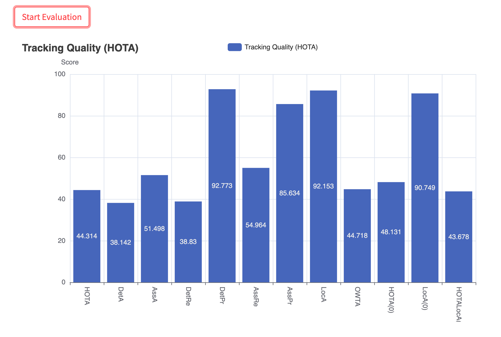

# MOT16-VisualTracker

## Repository Introduction
Welcome to the MOT16-VisualTracker! This tool is designed for developers working on Multiple Object Tracking (MOT) models using the MOT16 dataset. Our aim is to simplify the performance monitoring process during the development phase.

With MOT16-VisualTracker, you can easily upload the standard txt output required by the MOT16 challenge and use an intuitive slider to navigate through video frames. This tool automatically draws detection boxes on the frames, allowing you to visually compare your model's predictions with the ground truth.

Moreover, MOT16-VisualTracker offers detailed visual analytics. For any specified range of time frames, you can generate bar charts that display a variety of evaluation metrics. This visual feedback helps you understand your model's performance over time, pinpointing exactly when and where errors occur.

Our goal is to provide a seamless and insightful way to visualize tracking accuracy and model efficacy, enabling you to make informed improvements swiftly. Dive into the repository, explore the features, and streamline your model development with MOT16-VisualTracker!

Currently, MOT16-VisualTracker is equipped to analyze only the training set of the MOT16 dataset. This limitation arises because accessing all evaluation metrics requires the ground truth data, which is unavailable for the test sets due to the ongoing nature of the challenge. However, analyzing the training set is still highly valuable in the initial stages of model development.

Developers are encouraged to partition the available training set to create a separate validation segment, fully leveraging the features of this repository to monitor and enhance model performance. By utilizing MOT16-VisualTracker, you can gain insights into your model's behavior under controlled conditions.

Looking ahead, should this repository gain traction and prove useful to a broad range of developers, there is potential to collaborate directly with the organizers of the MOT challenge. Such a partnership could allow for the evaluation of your results and visualization of performance metrics through an API, all while maintaining the confidentiality of the test set ground truth. 


## How to Use MOT16-VisualTracker

### Setting Up and Running the Application
To begin using MOT16-VisualTracker, you'll need to install all necessary dependencies as specified in our `requirements.txt`. Once all dependencies are installed, you can launch the application by running the following command in your terminal:

```bash
streamlit run main.py --server.enableCORS false --server.enableXsrfProtection false
```

### Using the Application
After initiating the command, the Streamlit interface will open in your default web browser. Here’s how to navigate the tool:

1. **Select and Upload**: Upon the interface loading, select the video sequence you wish to analyze. You can then upload your model's output for the corresponding video sequence.

2. **Visualize Detection**: Use the slider bar to navigate through the frames. As you slide, the bounding boxes for object tracking will automatically render on the video, allowing you to visually compare your model's output with the ground truth seamlessly.

3. **Evaluate Performance**: Once you have decided on a specific range of frames to analyze, click the 'Start Evaluation' button. This will generate intuitive bar charts that display various evaluation metrics within your selected time frame, giving you a clear insight into your model's performance.

4. **Reset and Restart**: After you have finished evaluating, you can clear all data by clicking the 'Clear Evaluation' button. This will reset the application, allowing you to start a new analysis with a different video sequence.

By following these steps, you can effectively use MOT16-VisualTracker to monitor and improve your MOT models, gaining valuable insights into model performance and areas for enhancement.

### Demo



## Acknowledgements

We would like to extend our gratitude to the developers and contributors of the following projects, whose work has significantly enhanced the functionality of MOT16-VisualTracker:

1. **[TrackEval](https://github.com/JonathonLuiten/TrackEval)** - This repository is a fork of Jonathon Luiten's TrackEval. We have utilized tools within the `trackeval` folder extensively to acquire various evaluation metrics. The robust evaluation capabilities provided by TrackEval have been integral in offering comprehensive metric assessments within our tool.

2. **[ByteTrack](https://github.com/ifzhang/ByteTrack)** - We have incorporated parts of ByteTrack's codebase, particularly those responsible for drawing bounding boxes. Their efficient and effective visualization methods have greatly facilitated the user experience in tracking object movements across frames.

Our project builds upon these outstanding open-source contributions to offer a seamless and powerful tool for MOT model developers. We appreciate the opportunity to utilize such high-quality resources and recommend our users to explore these projects to further their understanding and capabilities in the field of object tracking.

## How to Run our code
